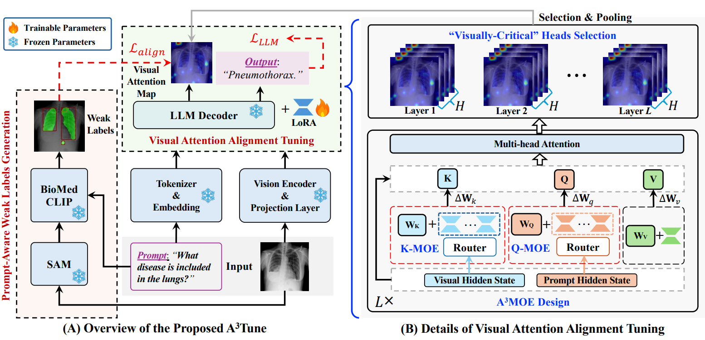

# **Focus on What Matters: Enhancing Medical Vision-Language Models with Automatic Attention Alignment Tuning**

### **ACL 2025 (Main Conference)**

**Aofei Chang, Le Huang, Alex James Boyd, Parminder Bhatia, Taha Kass-Hout, Cao Xiao, Fenglong Ma**

------

## ⭐ Overview

Medical Large Vision-Language Models (Med-LVLMs) have shown strong potential for clinical reasoning and multimodal understanding, yet they often suffer from **suboptimal or misaligned visual attention**. This can lead to hallucinations, incorrect diagnoses, and unreliable generation. Existing mitigation methods rely heavily on inference-time patching or require additional human supervision—both of which limit scalability and effectiveness.

**A³Tune (Automatic Attention Alignment Tuning)** is our new fine-tuning framework designed to *train models to fix their own attention distribution*. Instead of depending on gold segmentation labels, A³Tune builds a scalable supervision pipeline by:

- **Generating zero-shot weak labels using SAM**,
- **Refining them with prompt-aware semantic filtering via BioMedCLIP**,
- **Identifying and selectively tuning visually-critical attention heads**,
- **Introducing A³MoE**, a lightweight mixture-of-experts module that adaptively chooses parameter routes based on prompt and image context.

Together, these components produce Med-LVLMs that **attend more accurately, hallucinate less, and perform better** across medical VQA and report-generation benchmarks.

## 🖼️ Model Overview

<p align="center">    </p>


------

## 🔍 What’s Inside This Repository

This repository includes:

- 📦 **A³Tune Training Pipeline**
- 🧠 **Attention Head Selection & Tuning Implementation**
- 🖼️ **Zero-shot Label Refinement using SAM + BioMedCLIP**
- 🧩 **A³MoE module for adaptive attention tuning**
- 📊 **Evaluation scripts for VQA and report generation**
- 📁 Dataset preparation guidelines & pretrained models (to be released)

------

## 🚀 Highlights

- **No human labels needed** — scalable weak supervision via SAM + BioMedCLIP
- **Selective tuning** — modifies only visually-critical attention heads
- **Adaptive parameter routing** through the A³MoE module
- **State-of-the-art results** on multiple medical VQA & report-generation tasks
- **Improved visual grounding** and reduced hallucinations across diverse prompts and imaging modalities

## 📂 Dataset Information

We release **training and testing metadata** (e.g., annotations, splits) in the `./data` folder.
 However, due to dataset licensing constraints, **you must download the raw images yourself**.
 You can obtain all required images from the official sources below:

- **SLAKE:** https://www.med-vqa.com/slake/
- **VQA-RAD:** [Kaggle Dataset Link](https://www.kaggle.com/datasets/shashankshekhar1205/vqa-rad-visual-question-answering-radiology/data)
- **PathVQA:** https://www.scidb.cn/en/detail?dataSetId=b642b0f6572140d9b40f26b8b68b74e6
- **IU-Xray:** [Google Drive Download](https://drive.google.com/file/d/1c0BXEuDy8Cmm2jfN0YYGkQxFZd2ZIoLg/view)
- **OmniMedVQA:** https://openxlab.org.cn/datasets/GMAI/OmniMedVQA
- **MIMIC-CXR-JPG:** [PhysioNet Link](https://physionet.org/content/mimic-cxr-jpg/2.1.0/)


## 📦A³TUNE Directory Structure

The current directory structure is as follows:

```
A3Tune/
├── readme.md
├── LVLMs/
├── Segment/
```

### Weak Label Generation

The weak label generation process is located in the `Segment/` directory. Here, we generate weak labels for each dataset, which are then used for downstream fine-tuning.

### Main Experiments for A³TUNE

Our primary experiments for A³TUNE are located in the `LVLMs/llava-med/` directory.

- **Training Code**:
   The training code for `llava-med` can be found at:

  ```
  llava-med/llava/train/train.py
  ```

  In this file:

  - We import MoE module designs for **A³MoE** and incorporate additional parameters for training.

  - The preprocessing of weak labels is implemented in the `LazySupervisedDataset` class.

  - Implementation details are included in the forward function of the `LlavaLlamaForCausalLM` class.

    - The attention tuning loss function, `calculate_top_attention_loss` is defined in:

      ```
      LVLMs/llava-med/llava/model/utils.py
      ```

- **Training Scripts**:
   The training scripts for **A³TUNE** are located in:

  ```
  llava-med/scripts/train/moe/top_heads
  ```

### Inference Implementation

The inference implementation for both **A³TUNE** and baseline models can be found in the following directory:

```
llava-med/llava/eval/
```

- **Baselines**:
   The required baseline files are stored in:

  ```
  llava-med/llava/eval/
  ```

  This includes the baselines **avisc, PAI, and VCD**. Additionally, we integrate **DAMRO** and **M3ID** within the avisc paradigm.

- **Main Inference File**:
   The main file handling inference for both **A³TUNE** and baselines is:

  ```
  llava-med/llava/eval/model_vqa_med.py
  ```


### 📚 Reference

If you use **A³Tune** in your research, please cite:

```bibtex
@inproceedings{chang2025focus,
  title     = {Focus on What Matters: Enhancing Medical Vision-Language Models with Automatic Attention Alignment Tuning},
  author    = {Chang, Aofei and Huang, Le and Boyd, Alex James and Bhatia, Parminder 
               and Kass-Hout, Taha and Xiao, Cao and Ma, Fenglong},
  booktitle = {Proceedings of the 63rd Annual Meeting of the Association for 
               Computational Linguistics (ACL)},
  year      = {2025},
  address   = {Vienna, Austria},
  doi       = {10.18653/v1/2025.acl-long.460},
  url       = {https://aclanthology.org/2025.acl-long.460/}
}
```